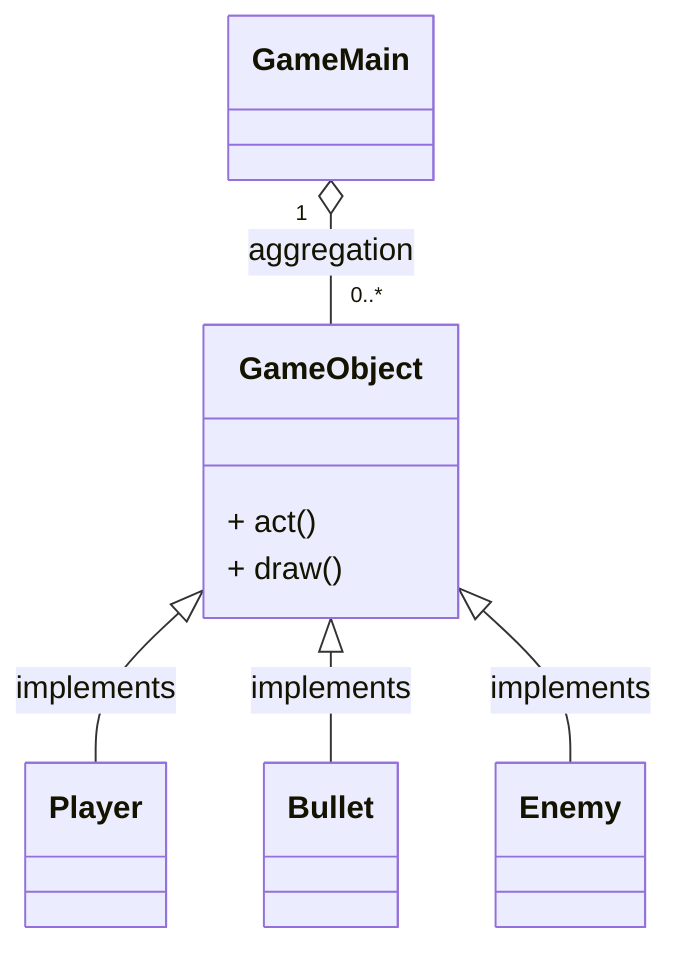
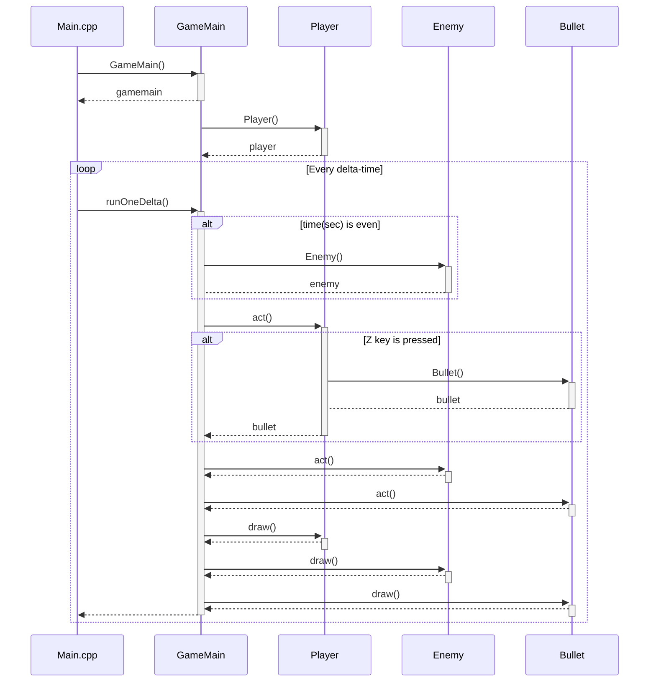
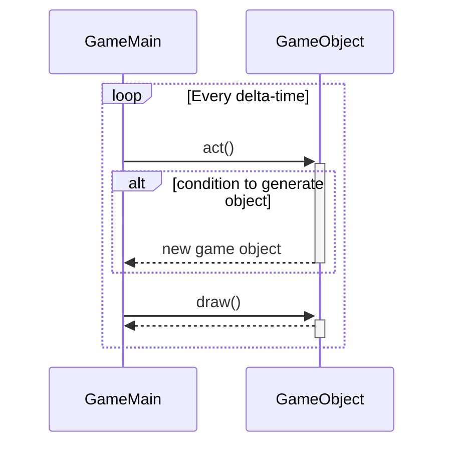

# Design choice
An educational material to choose which design is better.  
Following figures represent design B.

```mermaid
classDiagram
    class GameMain
	class GameObject {
		+ act()
		+ draw()
	}
	class Player
	class Bullet
	class Enemy
	GameObject <|-- Player : implements
	GameObject <|-- Bullet : implements
	GameObject <|-- Enemy : implements
	GameMain "1" o-- "0..*" GameObject : aggregation
```

```mermaid
sequenceDiagram
	Main.cpp ->>+ GameMain : GameMain()
	GameMain -->>- Main.cpp : gamemain

	GameMain ->>+ Player : Player()
	Player -->>- GameMain : player

	loop Every delta-time
		Main.cpp ->>+ GameMain: runOneDelta()

		alt time(sec) is even
			GameMain ->>+ Enemy : Enemy()
			Enemy -->- GameMain : enemy
		end

		GameMain ->>+ Player : act()
		alt Z key is pressed
			Player ->>+ Bullet : Bullet()
			Bullet -->- Player : bullet
			Player -->>- GameMain : bullet
		end

		GameMain ->>+ Enemy : act()
		Enemy -->>- GameMain : 

		GameMain ->>+ Bullet : act()
		Bullet -->>- GameMain : 

		GameMain ->>+ Player : draw()
		Player -->>- GameMain : 

		GameMain ->>+ Enemy : draw()
		Enemy -->>- GameMain : 

		GameMain ->>+ Bullet : draw()
		Bullet -->>- GameMain : 

		GameMain -->>- Main.cpp : 
	end
```

```mermaid
sequenceDiagram

	loop Every delta-time
		GameMain ->>+ GameObject : act()

		alt condition to generate object
		GameObject -->>- GameMain : new game object
		end

		GameMain ->>+ GameObject : draw()
		GameObject -->>- GameMain : 
	end
```
